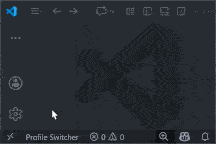
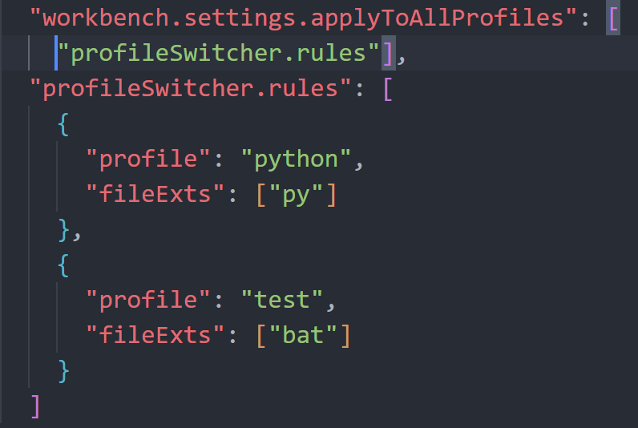
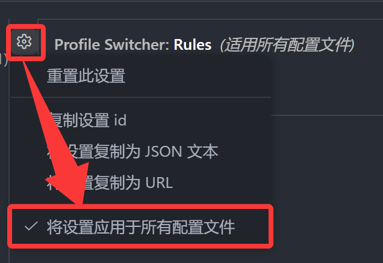
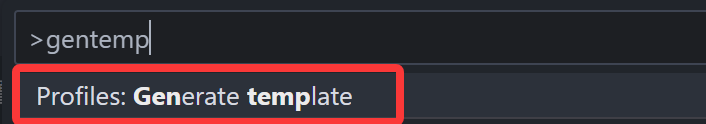
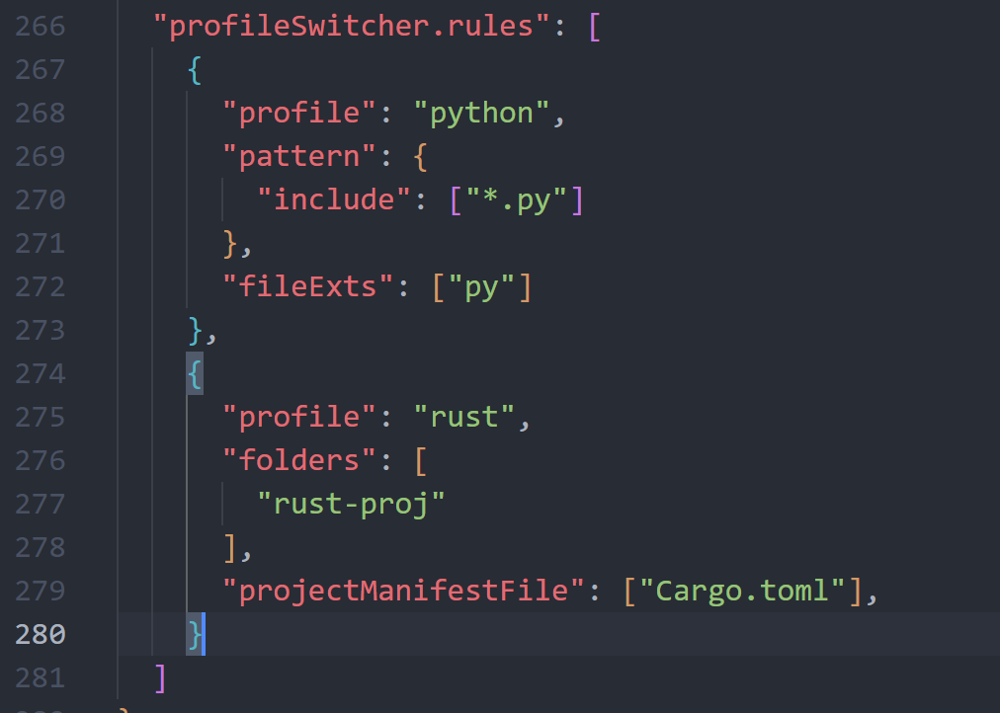

# VSCode Profile Switcher

## 中文说明 | [English](#english)

VSCode Profile Switcher 是一个 VSCode 扩展，可以根据不同的条件自动切换 VSCode 配置文件（Profile）。

### 功能特性
- 根据打开的文件夹自动切换配置文件
- 根据工作区文件自动切换配置文件
- 根据打开的文件扩展名自动切换配置文件
- 可通过状态栏手动切换配置文件
- 支持通过配置规则自定义切换逻辑

---
### Presentation

#### Presentation configuration:

---

### 使用方法
1. 确保在所有需要的配置文件上安装此扩展,
并将`profileSwitcher.rules`设置项应用到所有配置文件(如下所示), 以便可以从其中任何一个进行切换。

2. 请在**默认配置文件的设置文件**中配置 `profileSwitcher.rules`

示例

3. `ctrl+shift+p`打开命令面板输入 `Gentemplate` 生成配置模板文件，修改模版，再复制到`setting.json`
模板是通过读取你创建的所有**配置文件的名称**生成的(不包括默认配置), 不需要的选项可以删除

模板示例:

修改后复制到`setting.json`示例:

4. 扩展会根据配置的规则以及**打开的vscode窗口的工作区状态**自动切换配置文件.

---

### 配置选项
在 VSCode 设置中可以配置 `profileSwitcher.rules`，规则包含以下字段：
- `profile`: 配置文件名称
- `folders`: 指定文件夹，当打开这些指定文件夹下的子文件夹时使用指定的配置文件. **优先级最高**.
- `projectManifestFile`: 使用文件匹配模式，当工作区包含匹配的**不同编程语言特有的项目清单文件**(比如`Cargo.toml`,`package.json`)时使用指定的配置文件.
**此选项比通用的`pattern`选项优先级更高**.
- `pattern`: 使用文件匹配模式，当工作区包含匹配的文件时使用指定的配置文件
- `fileExts`: 根据文件扩展名切换配置文件. **只在窗口没有工作区打开但打开了文本文档时切换一次**, 窗口内没有文档打开时计数归零.

### 命令
- `Profiles: Gen template`: 生成配置模板文件
- `Profiles: Reload configuration`: 重新加载配置（当更改vscode配置文件即`profiles`后使用）

---

## English

VSCode Profile Switcher is a VSCode extension that automatically switches VSCode profiles based on different conditions.

### Features
- Automatically switch profiles based on opened folders
- Automatically switch profiles based on workspace files
- Automatically switch profiles based on opened file extensions
- Manually switch profiles via status bar
- Support custom switching logic through configuration rules

---
### [Presentation](#presentation)
---

### Usage
1. Make sure to install this extension on all the profiles you need, and apply the `profileSwitcher.rules` setting to all profiles (as shown below), so that you can switch from any of them. 

2. Please configure `profileSwitcher.rules` in the **settings file of the default profile**

Example

3. Open command palette with `ctrl+shift+p` and enter `Gentemplate` to generate a configuration template file, modify the template, then copy to `setting.json`
The template is generated by reading all the **profile names you created** (excluding the default profile), and options you don't need can be deleted

Template example:

Copy to `setting.json` after modification, example:

4. The extension will automatically switch profiles based on the configured rules and the **workspace state of the opened vscode window**.

---

### Configuration Options
In VSCode settings, you can configure `profileSwitcher.rules` with the following fields:
- `profile`: Profile name
- `folders`: Specify folders, when subfolders under these specified folders are opened, use the specified profile. **Highest priority**.
- `projectManifestFile`: Use file matching patterns, when the workspace contains matching **project manifest files specific to different programming languages** (such as `Cargo.toml`, `package.json`), use the specified profile. 
**This option has higher priority than the generic `pattern` option**.
- `pattern`: Use file matching patterns, when the workspace contains matching files, use the specified profile
- `fileExts`: Switch profiles based on file extensions. **Switches only once when the window has no workspace open but a text document is opened**, and the count resets when no document is open in the window.

### Commands
- `Profiles: Gen template`: Generate configuration template file
- `Profiles: Reload configuration`: Reload configuration (use after changing vscode profiles)

---

## Thank
Part of the code comes from the following projects

[robole/vscode-profile-status](https://github.com/robole/vscode-profile-status)
[CrendKing/vscode-auto-profile-switcher](https://github.com/CrendKing/vscode-auto-profile-switcher)